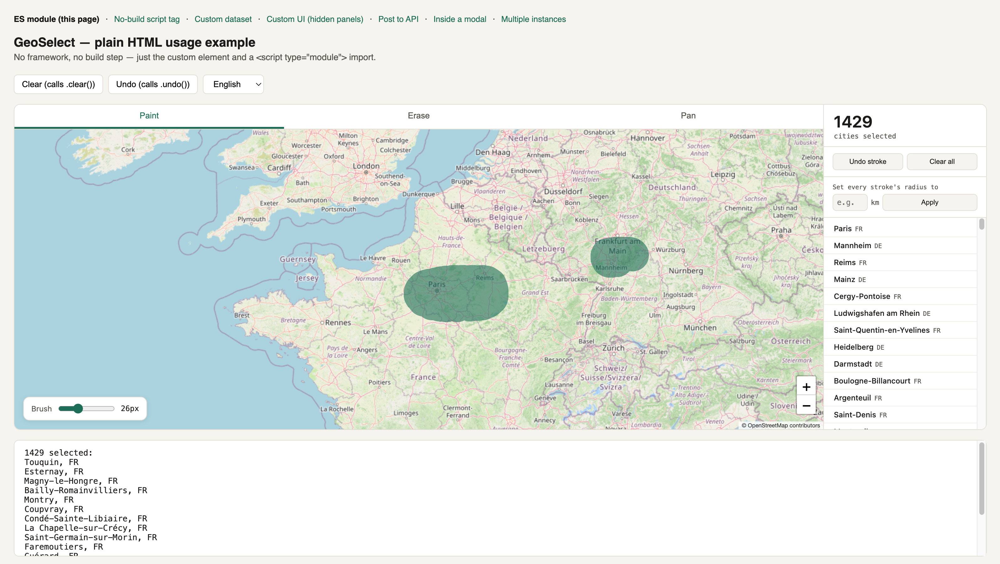
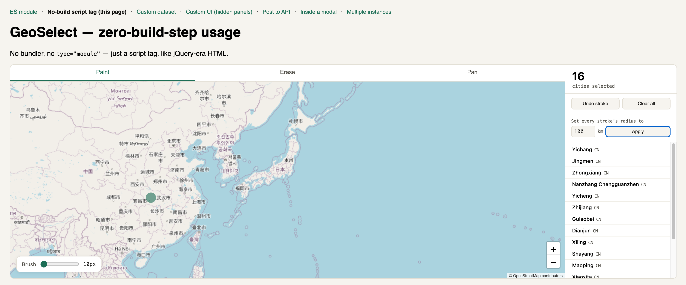
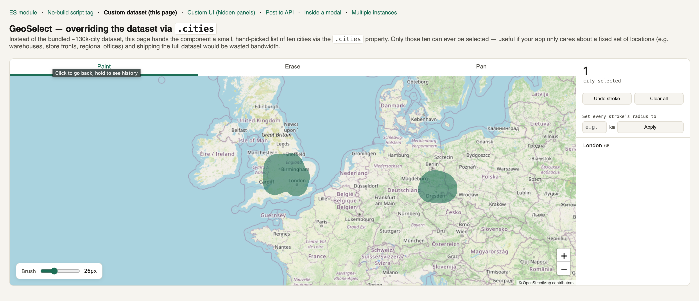
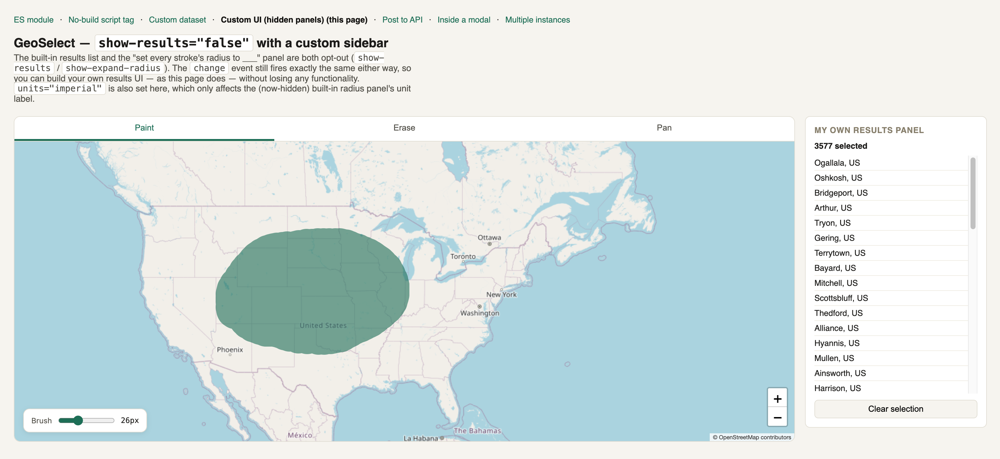
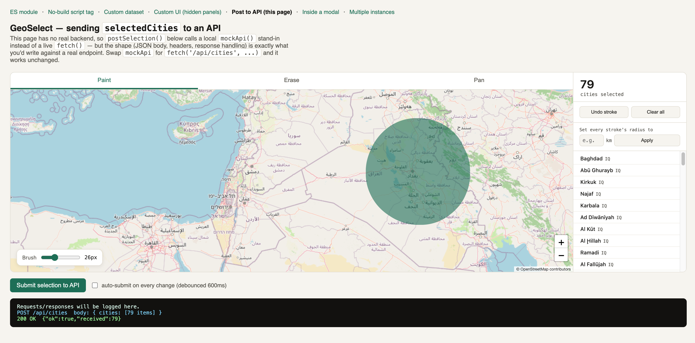
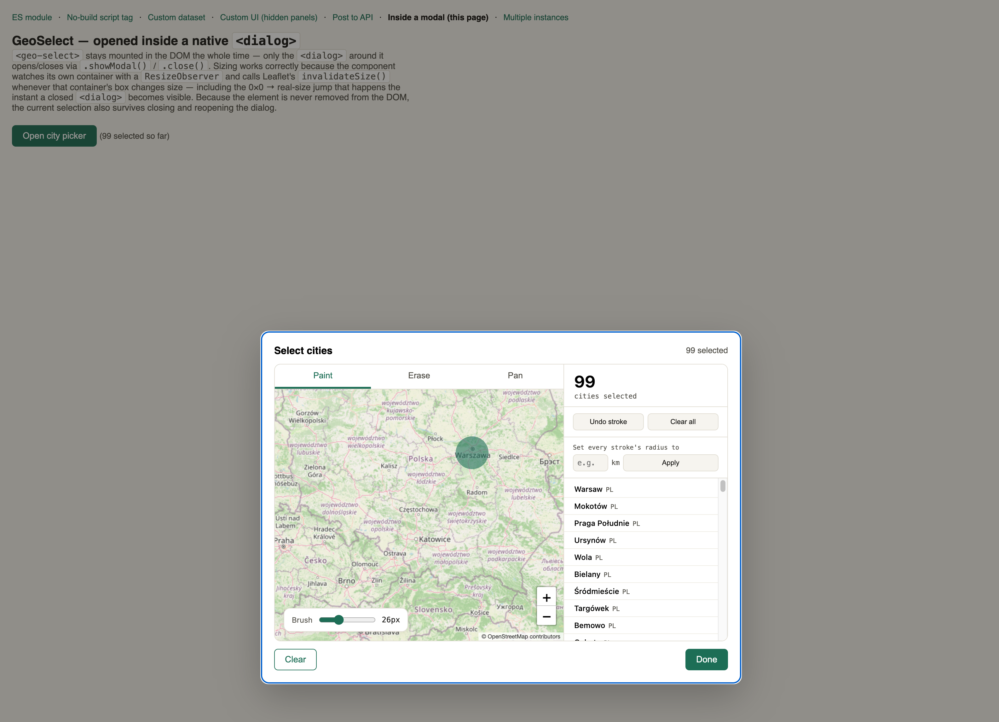
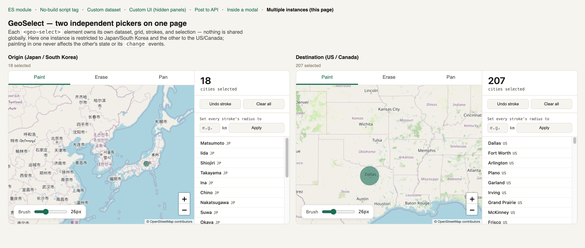

# GeoSelect

A map component for selecting cities by **painting over a map** — brush an
area with the mouse or a finger, and every city under the brush gets
selected — instead of typing into a search box or scrolling a giant
dropdown.

Built as a native **Web Component** (`<geo-select>`), so it works the same
way in React, Vue, Angular, Svelte, or a plain HTML page with no framework
at all. There is exactly one implementation; every framework just renders
the same custom element.



## Install

```bash
npm install geoselect leaflet
```

`leaflet` is a peer-ish runtime dependency — it's bundled into the built
files already, so you don't strictly need to install it separately unless
your bundler complains about duplicate copies if your app also uses Leaflet
directly.

## Quick start

```js
import 'geoselect';
```

```html
<geo-select
  default-center-city="Paris"
  default-zoom="5"
  style="height: 600px; width: 100%;"
></geo-select>

<script type="module">
  const picker = document.querySelector('geo-select');
  picker.addEventListener('change', (e) => {
    console.log(e.detail.cities);   // [{ name, country, lat, lng, population }, ...]
    console.log(e.detail.count);    // number
  });
</script>
```

No bundler? Use the global build directly:

```html
<script src="https://cdn.jsdelivr.net/npm/geoselect/dist/geoselect.global.js"></script>
<geo-select style="height: 500px;"></geo-select>
```

## Attributes

| Attribute | Default | Description |
|---|---|---|
| `default-center-city` | — | City name to center the map on at load (e.g. `"Tokyo"`). Falls back to a world view if not found in the dataset. |
| `default-zoom` | `2` | Zoom level paired with `default-center-city`. |
| `allowed-countries` | *(empty = all)* | Comma-separated ISO-3166 alpha-2 codes, e.g. `"FR,DE,IT"`. Restricts which cities can be selected. |
| `units` | `"metric"` | `"metric"` (km) or `"imperial"` (miles) — affects the radius-setting panel. |
| `default-brush-size` | `26` | Initial brush radius in screen pixels. |
| `language` | `"en"` | `en` \| `es` \| `fr` \| `de` \| `it` \| `zh` \| `ar` — translates the widget's own UI text. City/country names are never translated. |
| `show-expand-radius` | `"true"` | Set to `"false"` to hide the "set every stroke's radius to ___" panel. |
| `show-results` | `"true"` | Set to `"false"` to hide the built-in results sidebar — useful if you're building your own UI around the `change` event instead. |

All attributes are reactive except `default-center-city`, `default-zoom`,
and `units`, which only take effect on initial connection (changing them
live would silently recenter the map or reinterpret numbers mid-session,
which is more surprising than useful).

## Properties

```js
const picker = document.querySelector('geo-select');

// Override the dataset entirely — e.g. your own city list, or a filtered
// subset if you don't need the full bundled dataset for your use case.
picker.cities = [
  { name: 'Springfield', country: 'US', lat: 39.78, lng: -89.65, population: 114230 },
  // ...
];

// Read current selection at any time (also available via the "change" event)
picker.selectedCities; // → array of city objects

picker.clear(); // wipe the current selection
picker.undo();  // undo the last brush stroke
```

## Events

```js
picker.addEventListener('change', (e) => {
  e.detail.cities; // array of { name, country, lat, lng, population }
  e.detail.count;  // e.detail.cities.length, for convenience
});
```

Fires after every completed brush stroke, undo, clear, or programmatic
`.cities` assignment.

## Framework usage

**React**

```jsx
function CityPicker() {
  const ref = useRef(null);

  useEffect(() => {
    const el = ref.current;
    const onChange = (e) => console.log(e.detail.cities);
    el.addEventListener('change', onChange);
    return () => el.removeEventListener('change', onChange);
  }, []);

  return <geo-select ref={ref} default-center-city="Berlin" style={{ height: 600 }} />;
}
```

(React doesn't yet auto-translate camelCase props to custom-element
attributes the way it does for built-in DOM elements — pass config via
kebab-case attributes as shown, and reach for the DOM node directly for
`.cities`/`.selectedCities`/events, same as any other Web Component in React
today.)

**Vue**

```vue
<template>
  <geo-select
    default-center-city="Madrid"
    @change="onChange"
    style="height: 600px"
  />
</template>

<script setup>
function onChange(e) {
  console.log(e.detail.cities);
}
</script>
```

Vue supports custom elements natively — just make sure your build config
doesn't try to resolve `geo-select` as a Vue component (see Vue's
[`isCustomElement`](https://vuejs.org/guide/extras/web-components.html)
compiler option).

**Plain HTML** — see [`demo/plain-script.html`](https://github.com/gasperinn/geoselect/blob/main/demo/plain-script.html) in the repo.



More usage examples live in [`demo/`](https://github.com/gasperinn/geoselect/tree/main/demo) on GitHub, each a standalone HTML file with no
build step — clone the repo and open any of them directly, or serve the repo root and browse
between them (they cross-link via a nav bar):

| Demo | Description |
|---|---|
| [`custom-dataset.html`](https://github.com/gasperinn/geoselect/blob/main/demo/custom-dataset.html) | Overriding the bundled dataset via `.cities` |
| [`custom-ui.html`](https://github.com/gasperinn/geoselect/blob/main/demo/custom-ui.html) | Hiding the built-in panels for your own results UI |
| [`api-integration.html`](https://github.com/gasperinn/geoselect/blob/main/demo/api-integration.html) | Posting the selection to an API |
| [`modal.html`](https://github.com/gasperinn/geoselect/blob/main/demo/modal.html) | Opening the picker inside a modal `<dialog>` |
| [`multiple-instances.html`](https://github.com/gasperinn/geoselect/blob/main/demo/multiple-instances.html) | Multiple independent instances on one page |

<table>
<tr>
<td></td>
<td></td>
</tr>
<tr>
<td></td>
<td></td>
</tr>
<tr>
<td></td>
<td></td>
</tr>
</table>

## Project structure

```
src/
  GeoSelect.js         the custom element class (all logic lives here)
  default-cities.js    bundled dataset (full ~130k cities, auto-generated)
  i18n.js              translations for the widget's own UI text
  styles.js            component CSS, injected into Shadow DOM
  index.js             registers <geo-select> and exports the class
scripts/
  generate-cities.mjs  regenerates default-cities.js from GeoNames data
build.mjs              esbuild config — outputs dist/geoselect.{esm,global}.js
demo/                     (GitHub only — not published to npm, see below)
  index.html              ES module usage example
  plain-script.html       zero-build-step <script> tag usage example
  custom-dataset.html     overriding the bundled dataset via .cities
  custom-ui.html          hiding the built-in panels, building your own results UI
  api-integration.html    posting selectedCities to an API (debounced auto-submit)
  modal.html              opening the picker inside a native <dialog>
  multiple-instances.html two independent <geo-select> elements on one page
```

`demo/` lives in the [GitHub repo](https://github.com/gasperinn/geoselect/tree/main/demo)
but is excluded from the published npm package (see `files` in `package.json`) —
clone the repo to run the demos locally.

## Dataset size

The bundled default is the **full dataset — ~130,000 cities worldwide**,
not a trimmed-down subset. That's a deliberate choice: no city is missing
by default, so `allowed-countries` or any other filtering is purely
optional convenience, never a workaround for missing coverage.

The honest trade-off: this makes the built files large — **~9.4MB
minified, ~2.5MB gzipped**. Over the wire, with gzip (which virtually
every CDN and static host applies automatically), that's a one-time
~2.5MB fetch, cached by the browser afterward. If that's too heavy for
your use case (e.g. a mobile-first app, or you only ever need one
country), two options:

1. Edit `scripts/generate-cities.mjs` to filter by population or
   country before writing `default-cities.js`, then `npm run
   generate:cities` and rebuild.
2. Skip the bundled dataset at runtime entirely and assign your own via
   `picker.cities = [...]` — the component doesn't care where the array
   came from.

## Attribution

City data originates from [GeoNames](https://www.geonames.org/) (CC BY
4.0) via the `all-the-cities` npm package. Map tiles are from
[OpenStreetMap](https://www.openstreetmap.org/copyright); the on-map "©
OpenStreetMap contributors" attribution is required by OSM's tile usage
policy and should not be removed if you keep using their tile server.

## License

MIT
